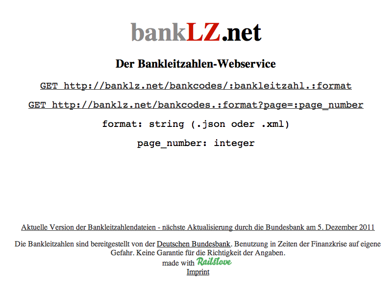
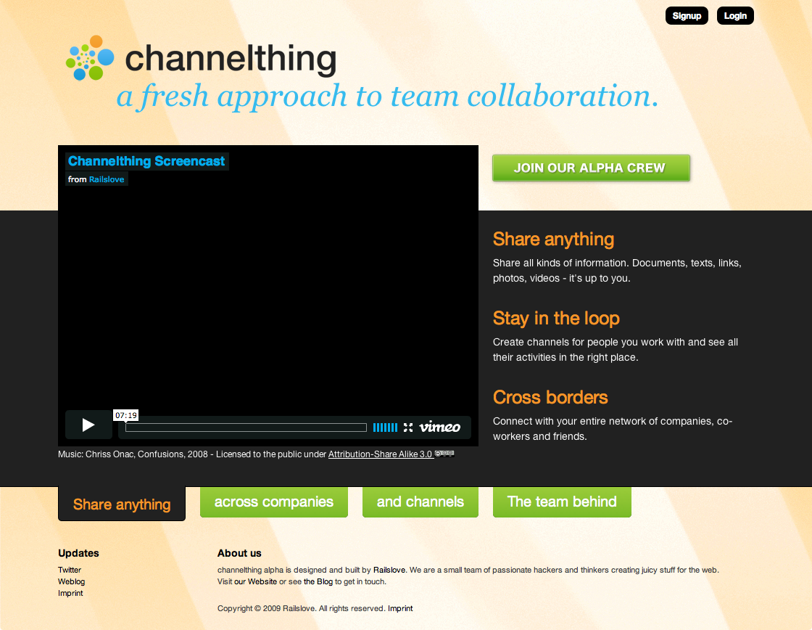
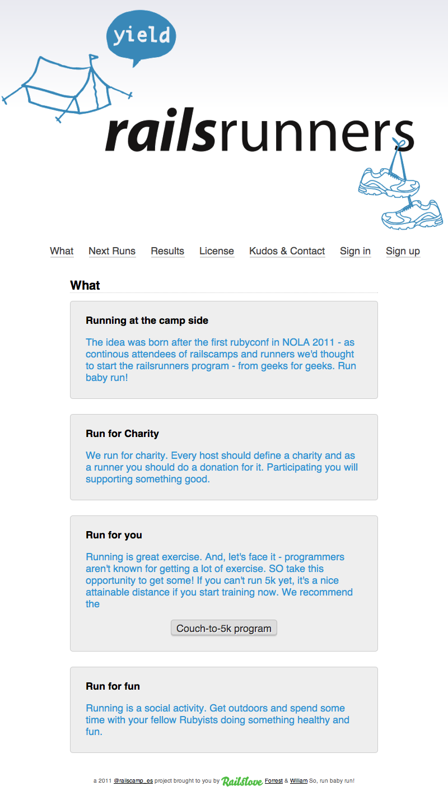

!SLIDE callout orange

Eigene Projekte

!SLIDE full-page-image

!SLIDE

# Tipplr

* „Das nächste Spiel ist immer das Nächste.“ - Matthias Sammer
  * Und wir machen mit!
  * B2B Tippspiel als Kundenbindungs- oder Marketingsinstrument
  * Zur WM 2010 schon erfolgreich mehrere Tipprunden gelaunched
  * Features wie: eigenes Customizing, Preise auf Plätze, Rankings, "Zweikampf", uvm.
  * In Zusammenarbeit mit HauptwegeNebenwege GmbH aus Köln
* Mehr Informationen
  * http://Tipplr.de
  * Broschüre und Slides

!SLIDE full-page-image

!SLIDE

# Salesking

* SaaS Plattform für Prozesse rund um das Rechnungswesen
  * Gründer: Georg Leciejewski
  * Erstes Investment von Railslove 
* Rechnungserstellungssoftware für diverse Zielgruppen
  * Freelancer
  * B2B
* Kunden aus NRW
  * Sevenload
  * Textprovider 

!SLIDE full-page-image

!SLIDE

# Dealbase

* Initial ein Kundenprojekt für eVenture Capital Partners aus Hamburg
  * Strategischer Partner
  * Eins der ersten Projekte
* http://dealbaseapp.com
  * Einfache SaaS zur Verwaltung von Deals "jeglicher Art"
  * Für Startups, Venture Capitalists, Organisationen, etc.
  * Hilft Unternehmen beim Dealflow Managment
  * Customizable
  * Smarte Software - keine "Eierlegende Wollmilchsau"
* Aktuell - heisse Entwicklungsphase
  * Überarbeitung des UI's
  * Mandantenfähigkeit
  * E-Mail und Dropboxintegration

!SLIDE full-page-image

!SLIDE

# Kölsch Deckel

* ....
  * ...
  * ...
* ...

!SLIDE full-page-image

!SLIDE

# Nerd Pursuit/Hackerspursuit

* ....
  * ...
  * ...
* ...

!SLIDE full-page-image

!SLIDE

# Awesome Bot Factory

* ....
  * ...
  * ...
* ...

!SLIDE full-page-image

!SLIDE

# BankLZ

* ....
  * ...
  * ...
* ...

!SLIDE full-page-image

!SLIDE

# Channelthing

* ....
  * ...
  * ...
* ...

!SLIDE full-page-image

!SLIDE

# Coworking.de

* ....
  * ...
  * ...
* ...

!SLIDE full-page-image

!SLIDE

# Happypdf

* ....
  * ...
  * ...
* ...

!SLIDE full-page-image

!SLIDE

# Railsrunners

* ....
  * ...
  * ...
* ...

!SLIDE callout

# Railslove...

 ...das sind 20 kreative Köpfe die sich täglich darüber den Kopf zerbrechen

!SLIDE callout lila

# wie man das internet

REVOLUTIONIEREN KANN