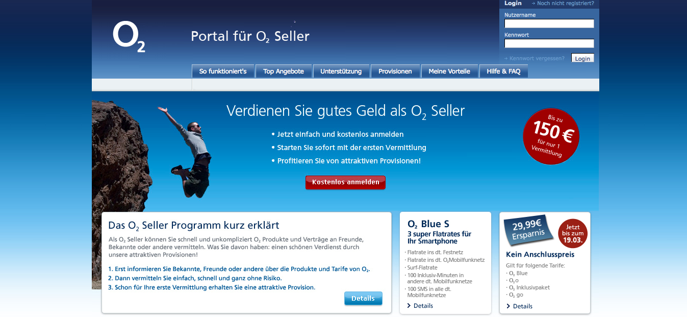

!SLIDE callout cyan

Realisierte Kundenprojekte

!SLIDE full-page-image

!SLIDE

# 9flats.com

* Tech Specs
  * Neu- und Weiterentwicklung
  * Ruby on Rails 3.0
  * MySQL
* Besonderheiten
  * ...
  * ...  

!SLIDE full-page-image

!SLIDE full-page-image

!SLIDE

# payango.com / kisscard.com

* Tech Specs
  * ...
  * ....
  * ...
* Besonderheiten
  * ...
  * ...  

!SLIDE full-page-image

!SLIDE

# o2seller.de

* Tech Specs
  * ...
  * ....
  * ...
* Besonderheiten
  * ...
  * ...  

!SLIDE full-page-image

!SLIDE

# jobmensa.de

* Tech Specs
  * ...
  * ....
  * ...
* Besonderheiten
  * ...
  * ...  

!SLIDE full-page-image

!SLIDE

# persofaktum.com

* Tech Specs
  * ...
  * ....
  * ...
* Besonderheiten
  * ...
  * ...  

!SLIDE full-page-image

!SLIDE

# Avocadostore

* Tech Specs
  * ...
  * ....
  * ...
* Besonderheiten
  * ...
  * ...  

!SLIDE full-page-image

!SLIDE

# Brandslisten

Customer care is the future of marketing and brandslisten is your instant-on customer support on the web.

* Tech Specs
  * ...
  * ....
  * ...
* Besonderheiten
  * ...
  * ...  

!SLIDE full-page-image

!SLIDE

# Jamii

* Tech Specs
  * ...
  * ....
  * ...
* Besonderheiten
  * ...
  * ...  

!SLIDE full-page-image

!SLIDE

# KKK

* Tech Specs
  * ...
  * ....
  * ...
* Besonderheiten
  * ...
  * ...  

!SLIDE full-page-image

!SLIDE

# o2seller

* Tech Specs
  * ...
  * ....
  * ...
* Besonderheiten
  * ...
  * ...  

!SLIDE full-page-image

!SLIDE

# Stayscout

* Tech Specs
  * ...
  * ....
  * ...
* Besonderheiten
  * ...
  * ...  

!SLIDE full-page-image

!SLIDE

# Tweetranking

* Tech Specs
  * ...
  * ....
  * ...
* Besonderheiten
  * ...
  * ...  

!SLIDE full-page-image

!SLIDE

# Zilino

* Tech Specs
  * ...
  * ....
  * ...
* Besonderheiten
  * ...
  * ...  

!SLIDE full-page-image

!SLIDE

# Pokenvision

High 4, pokenvision is here - our first #yai7d project developed in an agile one-week-sprint with the missionpoken.de guys. Place your poken on the map to let your not-yet-friends see where to poke next time.. ;-)

* Tech Specs
  * ...
  * ....
  * ...
* Besonderheiten
  * ...
  * ...  
