!SLIDE callout cyan

# Realisierte

Kundenprojekte

!SLIDE full-page-image

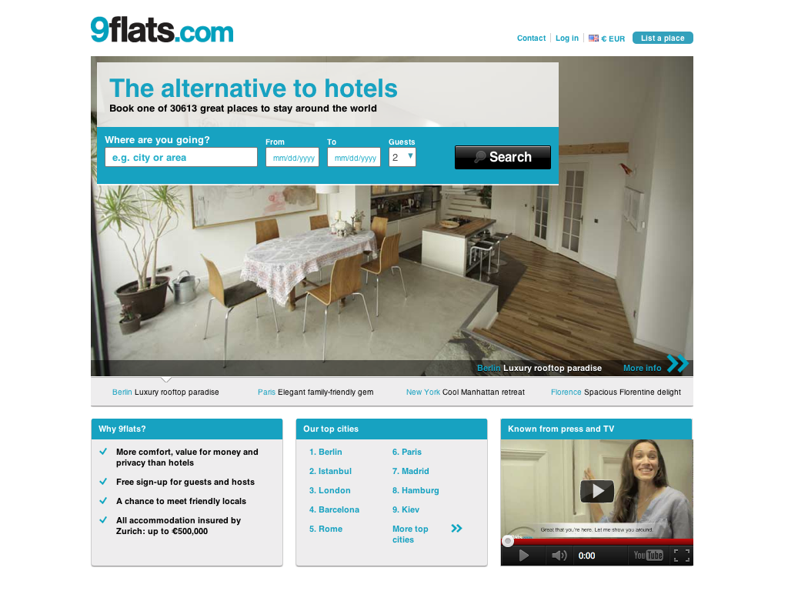

!SLIDE

# 9flats.com

Auf 9flats.com können Mitglieder Privatunterkünfte weltweit mieten oder vermieten. Als Alternative zum klassischen Hotel ist 9flats in mehr als 100 Ländernvertreten und bietet Unterkünfte für jeden Geschmack und jedes Budget.

* Tech Specs
  * Neu- und Weiterentwicklung
  * Ruby on Rails 3.0
  * MySQL
* Besonderheiten
  * ...
  * ...  

!SLIDE full-page-image

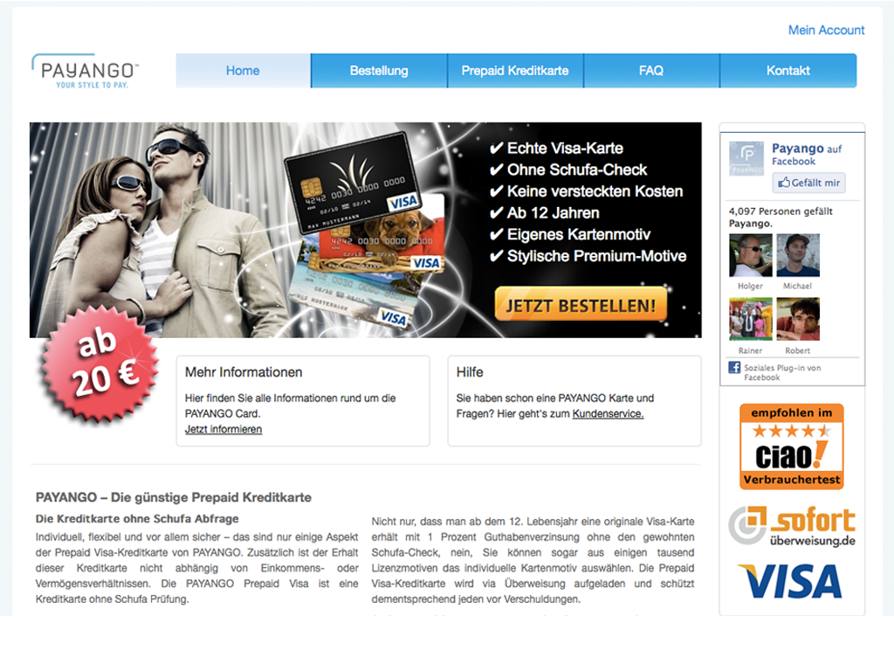

!SLIDE full-page-image

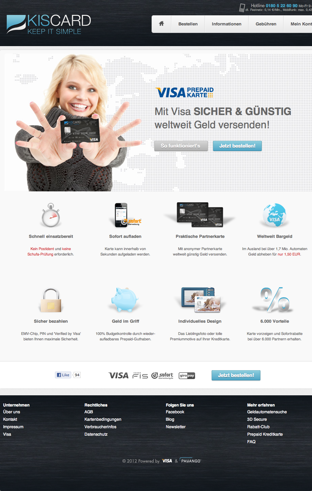

!SLIDE

# payango.com/kiscard.de

Seit 2009 bietet Payango eine Vielfalt an Prepaid Bezahl-Lösungen in Zusammenarbeit mit Finanzinstituten in Europa an. Von co-gebrandeten Prepaid Kreditkarten für Endkunden zu Online Auszahlungslösungen für Unternehmen aller Größenklassen bietet Payango Zahlungen aus einer Hand.  
Die KisCard ist eine Schufa-freie Kreditkarte der Payango GmbH. 

* Tech Specs
  * ...
  * ....
  * ...
* Besonderheiten
  * ...
  * ...  

!SLIDE full-page-image

!SLIDE

# o2seller.de

Das o2seller Programm ist ein neuer Vertriebsweg der Münchner Mobilfunkanbieter. Zufriedene Endkunden können schnell und unkompliziert o2 Produkte und Verträge an Freunde, Familie und Bekannte vermitteln. 

* Tech Specs
  * ...
  * ....
  * ...
* Besonderheiten
  * ...
  * ...  

!SLIDE full-page-image

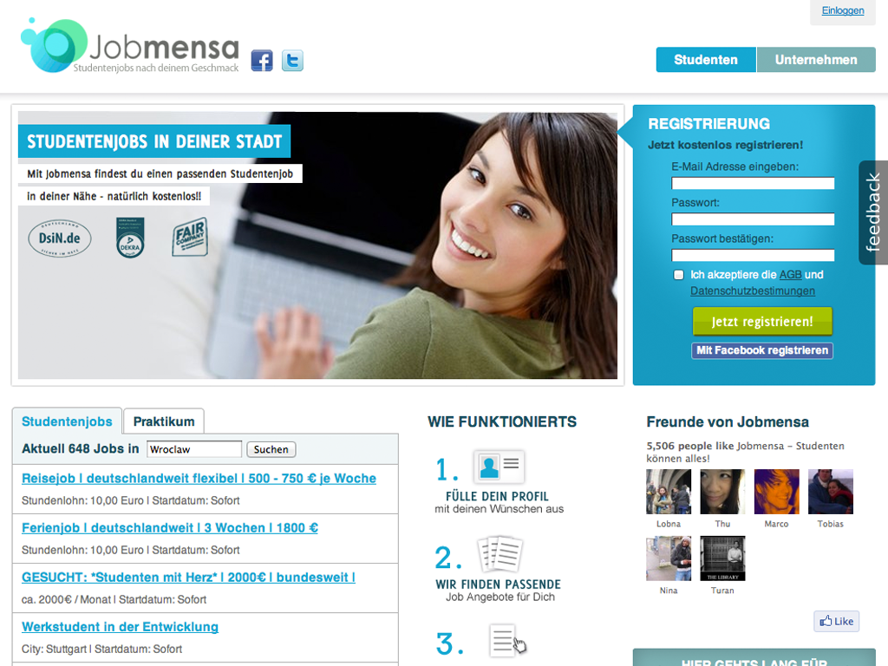

!SLIDE

# jobmensa.de

Als Deutschlands größte Stellenplattform für Studenten bietet Jobmensa ein großes Angebot an Studentenjobs, Nebenjobs, Ferienjobs etc. - und zwar deutschlandweit. Über 7.000 deutsche und internationale Unternehmen nutzen Jobmensa bereits für die Besetzung offener Stellen.

* Tech Specs
  * ...
  * ....
  * ...
* Besonderheiten
  * ...
  * ...  

!SLIDE full-page-image

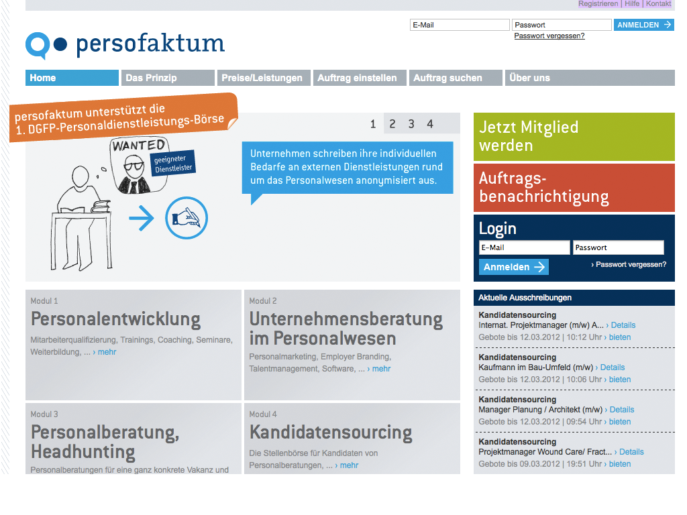

!SLIDE

# persofaktum.com

Persofaktum ist eine Recherche- und Vermittlungsplattform für Dienstleistungen rund um das Personalwesen. 2011 konnte Persofaktum als beste Innovation für das Personalmanagement überzeugen und darf sich seitdem „HR Innovator 2011“ nennen. 

* Tech Specs
  * ...
  * ....
  * ...
* Besonderheiten
  * ...
  * ...  

!SLIDE full-page-image

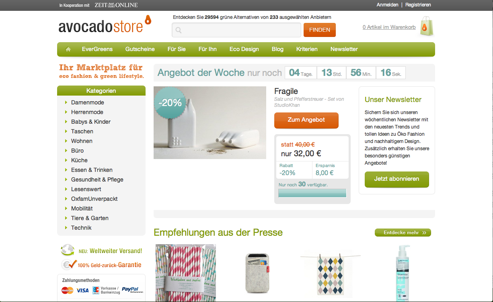

!SLIDE

# Avocadostore

Avocado Store ist Deutschlands größter Online Marktplatz für nachhaltige Produkte. Von Damenmode über Wohn-Accessoires bis hin zu Kinderspielsachen, bei Avocado Store findet man für jedes konventionelle Produkt eine grüne Alternative. Das Hamburger Team hat mit seinem Konzept schon einige Preise gewonnen.

* Tech Specs
  * ...
  * ....
  * ...
* Besonderheiten
  * ...
  * ...  

!SLIDE full-page-image

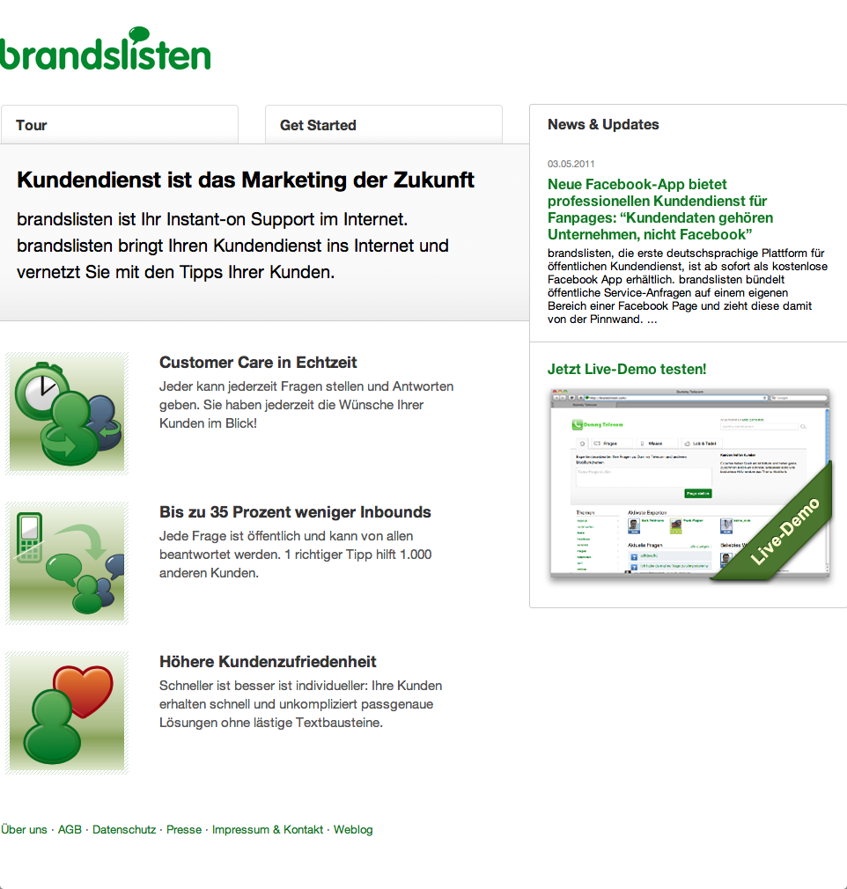

!SLIDE

# Brandslisten

Brandslisten ist ein Kundendienst mit den Mitteln des Social Web. Der Dienstleister betreibt für Firmen Communities für Kundenfragen. Auf diesen übernehmen die Nutzer selbst den Service. 

* Tech Specs
  * ...
  * ....
  * ...
* Besonderheiten
  * ...
  * ...  

!SLIDE full-page-image

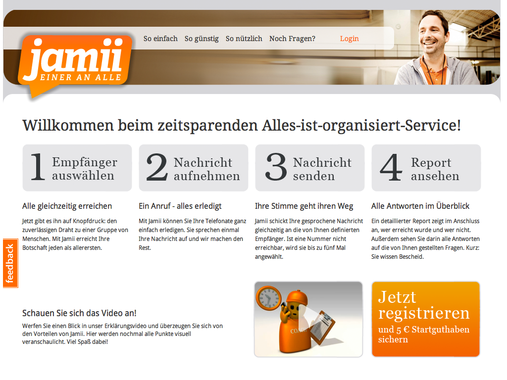

!SLIDE

# Jamii

jamii fördert und unterstützt die persönliche Kommunikation, macht sie schnell und effektiv. Mit jamii connect und VIPcall hat die jamii GmbH zwei Weltneuheiten auf den Markt gebracht, die als Kernidee einen vereinfachten Kommunikationsaustausch haben.

* Tech Specs
  * ...
  * ....
  * ...
* Besonderheiten
  * ...
  * ...  

!SLIDE full-page-image

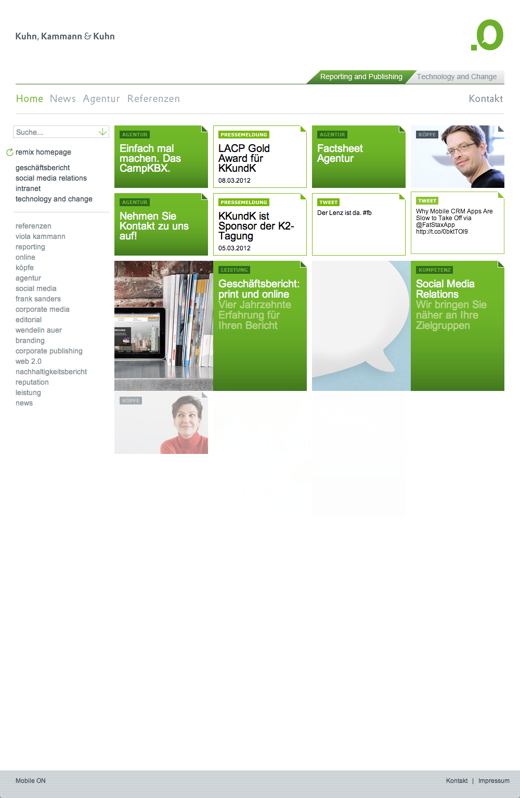

!SLIDE

# KKK

Ist eine unserer ersten Apps und gleichzeitig die Agentur Website für Kuhn, Kammann & Kuhn. Entwickelt wurde sie mit Rails, viel Liebe und JavaScript haiku.

* Tech Specs
  * ...
  * ....
  * ...
* Besonderheiten
  * ...
  * ...  

!SLIDE full-page-image

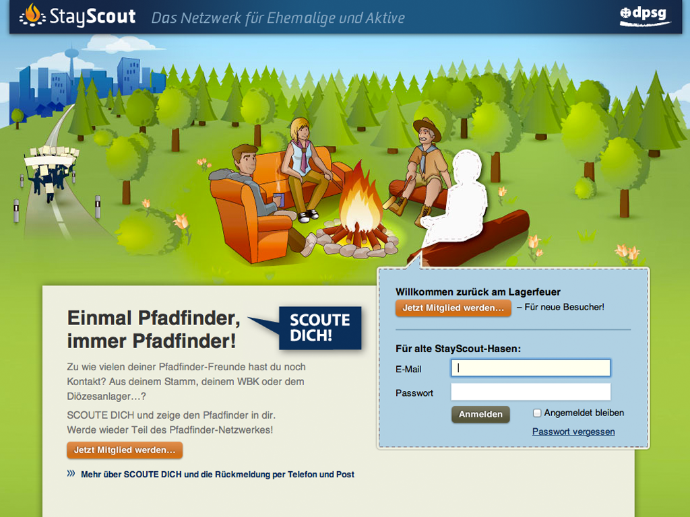

!SLIDE

# Stayscout

StayScout die DPSG-Community für Ehemalige und aktive Pfandfinder und Leiter. Ehemaligen finden hier Freunde von damals wieder, sie können an ihre alten Gruppen anknüpfen und ihre Erlebnisse von früher aufleben lassen.

  * ...
  * ....
  * ...
* Besonderheiten
  * ...
  * ...  

!SLIDE full-page-image

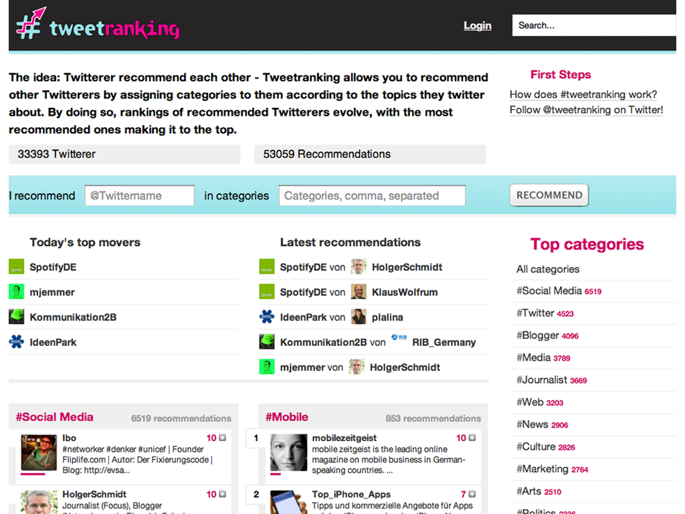

!SLIDE

# Tweetranking

Auf Tweetranking können Twitterer andere Twitterer empfehlen und ihnen dabei Kategorien zuordnen, also eines oder mehrere Themen nennen, zu denen der Twitterer Interessantes schreibt.

* Tech Specs
  * ...
  * ....
  * ...
* Besonderheiten
  * ...
  * ...  

!SLIDE full-page-image

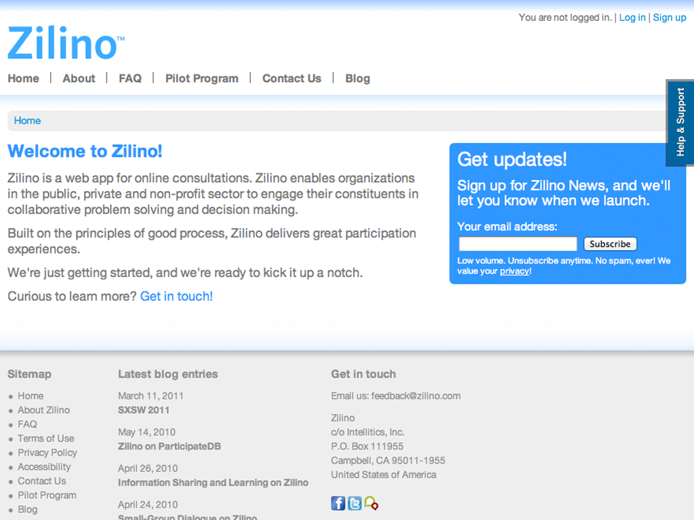

!SLIDE

# Zilino

Zilino ist eine Webapplikation, die Organisationen bei der Entscheidungsfindung in Gruppendiskussionen unterstützt. Ziel ist es Onlinediskussionen effizienter, komfortabler und interessanter zu gestalten.

* Tech Specs
  * ...
  * ....
  * ...
* Besonderheiten
  * ...
  * ...  

!SLIDE full-page-image

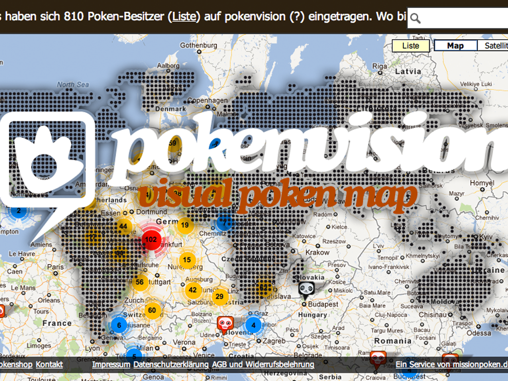

!SLIDE

# Pokenvision

Bei Pokenvision handelt es sich um eine kleine Rails-App, bei der sich Poken-Besitzer samt ihrer Pokens auf einer Weltkarte platzieren können. Das Google Maps-Mashup für Poken-Fans, wurde im Auftrag und in Zusammenarbeit mit der missionpoken.de-Crew realisiert.

* Tech Specs
  * ...
  * ....
  * ...
* Besonderheiten
  * ...
  * ...  

!SLIDE full-page-image

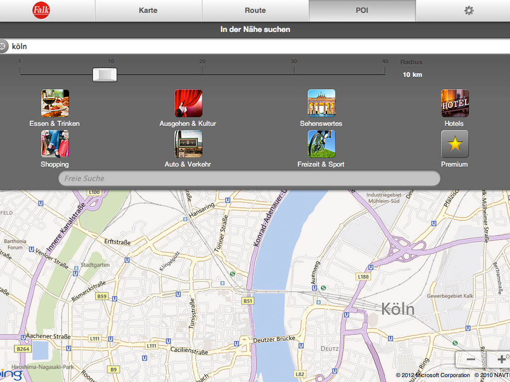

!SLIDE

# Falk Mobile

Mit Falk Mobile sind der Falk Routenplaner, die Karten, sowie mehrere Millionen touristische Sonderziele, wie Museen, Restaurants oder Kinos, direkt auf dem mobilen Endgerät abrufbar.

* Tech Specs
  * ...
  * ....
  * ...
* Besonderheiten
  * ...
  * ...  

!SLIDE full-page-image

!SLIDE

# moviepilot.com

moviepilot.com ist eine neue, globale Plattform für brandneue und klassische Kinofilme und deren Fans. Hier kann man Neuigkeiten, Fakten und Trailer rund um die Filme diskutieren, lange bevor diese in die Kinos kommen.

* Tech Specs
  * ...
  * ....
  * ...
* Besonderheiten
  * ...
  * ...  

!SLIDE full-page-image

!SLIDE

# phase2generator

Der phase2generator, bietet potentiellen Gründern einen grafischen Rahmen, in welchem die Geschäftsidee dargestellt wird und führt den Gründer Schritt für Schritt durch das Ausfüllen, bis man zum Schluss das Geschäftsmodell vor sich sieht.

* Tech Specs
  * ...
  * ....
  * ...
* Besonderheiten
  * ...
  * ... 

!SLIDE full-page-image

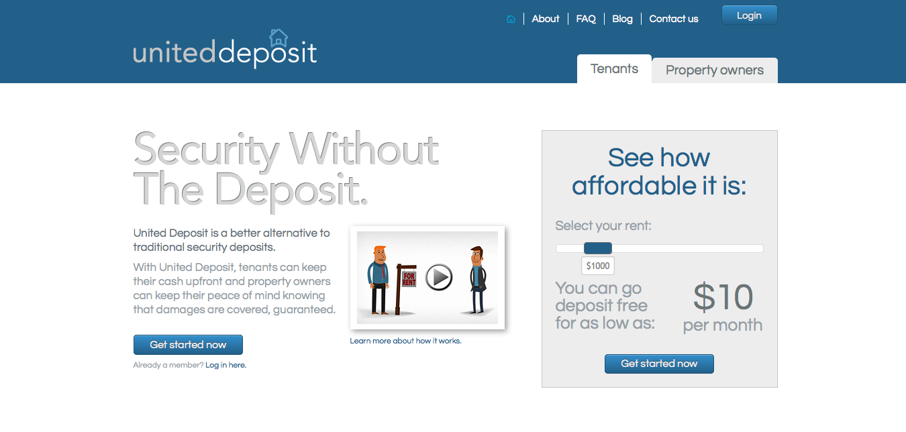

!SLIDE

# United Desposit

United Deposit stellt eine Alternative zur allgemeinen Mietkaution dar. Mieter müssen keine hohe Kaution im Voraus mehr zahlen und Vermieter können sich darauf verlassen, dass das Mietoblejt durch United Deposit geschützt ist. 

* Tech Specs
  * ...
  * ....
  * ...
* Besonderheiten
  * ...
  * ... 