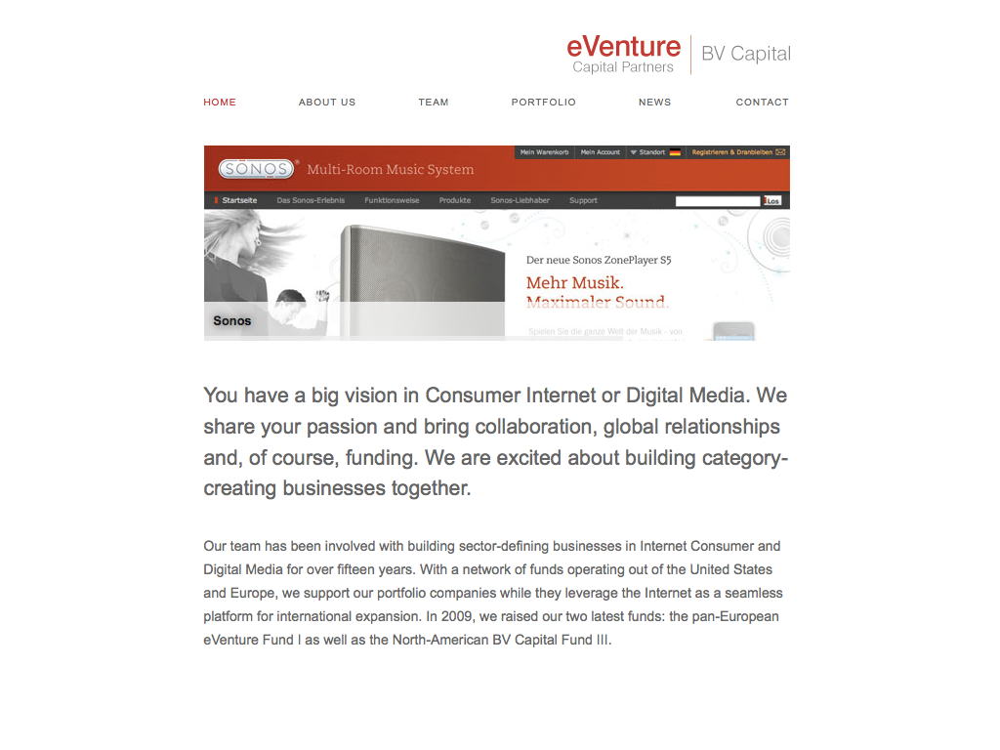
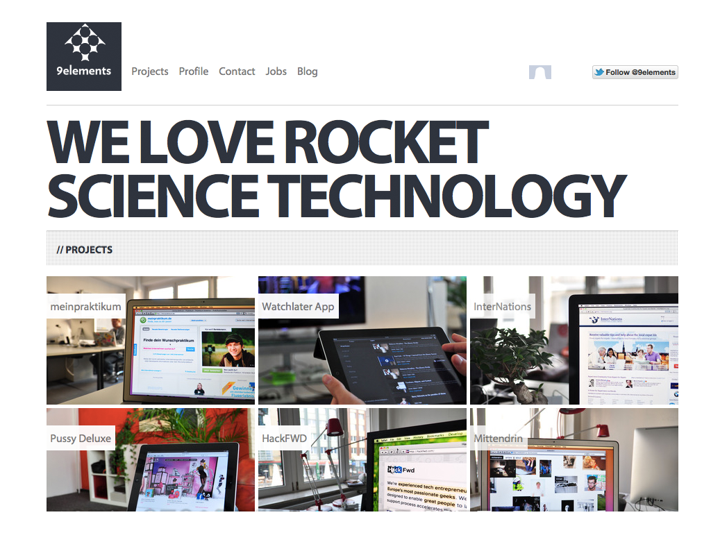
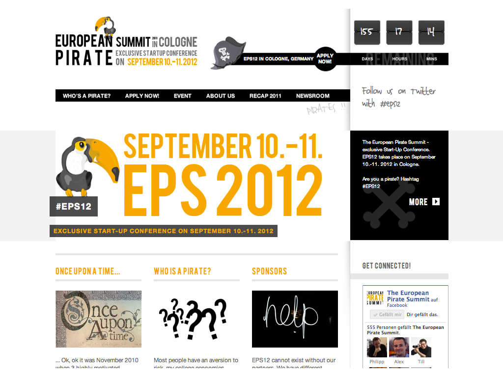

!SLIDE callout lila

Friends of Railslove

!SLIDE full-page-image

!SLIDE

# eVenture Capital Partners | BV Capital

eVenture Capital Partners ist ein auf Internetstartups fokussiertes Early-Stage-Investment Unternehmen, dass derzeit aus zwei Fonds heraus investiert: BV Capital III in Nord Amerika und eVenture I in Europa.  BV Capital investiert seit mehr als 15 Jahren in Internet-Unternehmen. Seit 2008 entwickelen wir interne Apps für BV Capital.

!SLIDE full-page-image

!SLIDE

# 9elements

9elements ist eine Softwareagentur aus dem Herzen des Ruhrgebiets. Sie entwickeln leidenschaftlich Web Applikationen mit Rails und Node.js, Designs für das moblie Web und mobile Apps für iPhone und iPad in Objective-C.   

!SLIDE full-page-image

!SLIDE

# European Pirate Summit

Lorem ipsum dolor sit amet, consectetur adipisicing elit, sed do eiusmod
tempor incididunt ut labore et dolore magna aliqua. Ut enim ad minim veniam,
quis nostrud exercitation ullamco laboris nisi ut aliquip ex ea commodo
consequat. Duis aute irure dolor in reprehenderit in voluptate velit esse
cillum dolore eu fugiat nulla pariatur. Excepteur sint occaecat cupidatat non
proident, sunt in culpa qui officia deserunt mollit anim id est laborum.

!SLIDE full-page-image

!SLIDE

# Medien.NRW

Information, Beratung und Vernetzungsangebote aus einer Hand: Das Mediencluster NRW ist eine One-Stop-Agency, wenn es um Medien in Nordrhein-Westfalen geht. Ihr Auftrag lautet, Wachstum und Innovation im Medienland NRW zu fördern und die digitale Zukunft der Medien mitzugestalten.