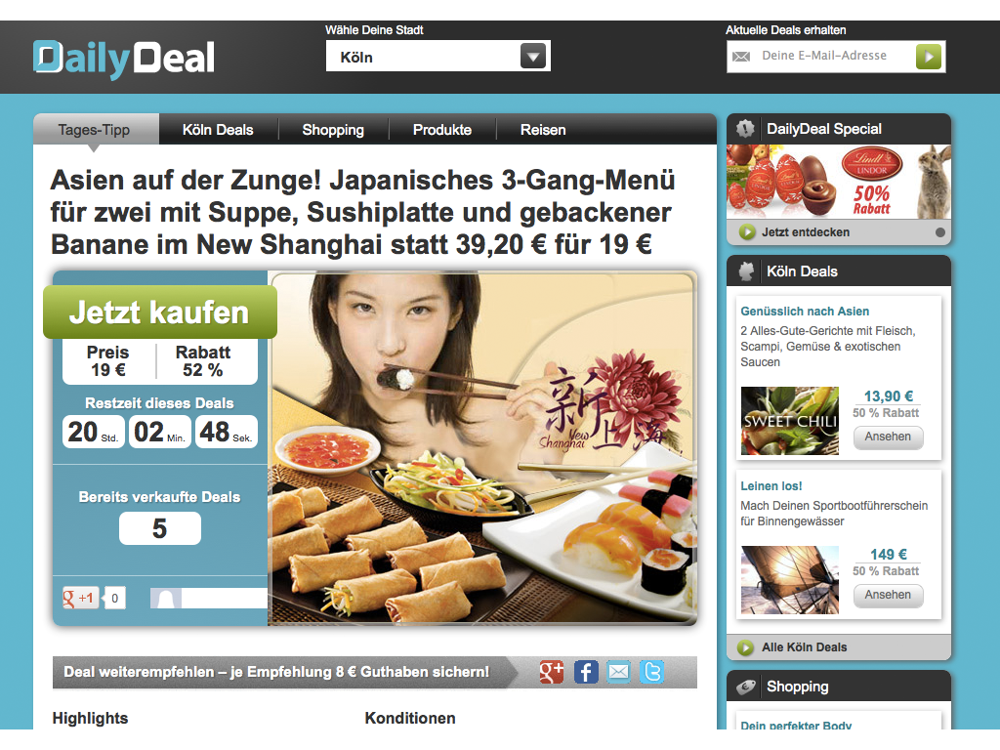
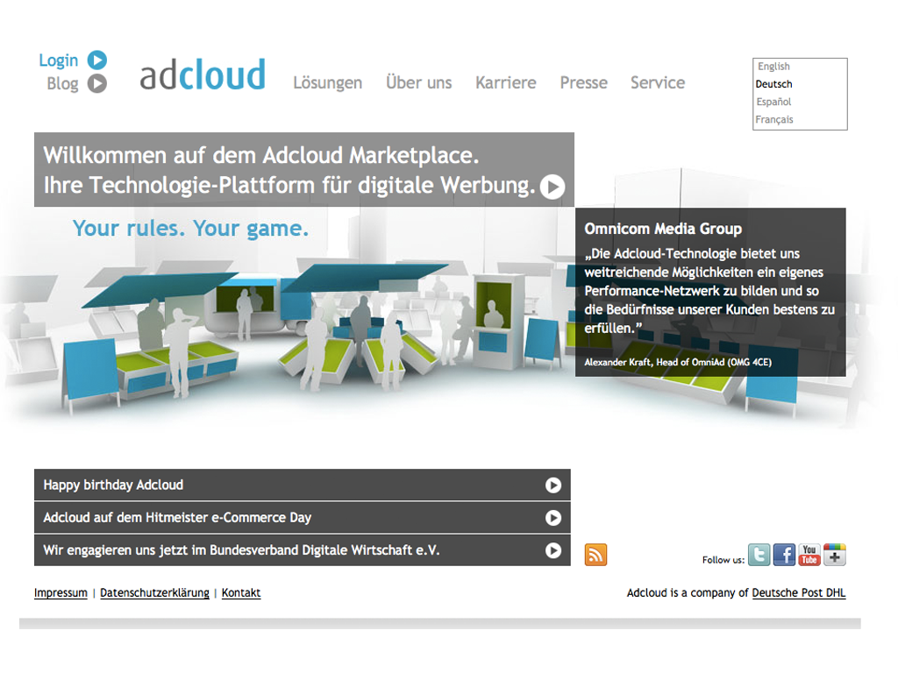

!SLIDE callout orange

Schulungen

!SLIDE

# Das Problem

Entwicklermangel auf dem Fachmarkt und mangelnde Förderung von Studierenden
  
# Die Ziele
  
Nachwuchsförderung, Wissensaustausch, Ausschöpfung des wirtschaftlichen Potentials

# Die Zielgruppe

Freelancer, Unternehmen, Studenten, Schüler, Kids

# 2012 Stärkung des Austausches zwischen

Unternehmen und öffentlichen Institutionen

!SLIDE full-page-image

!SLIDE full-page-image

!SLIDE

# DailyDeal GmbH

DailyDeal ist ein Städteportal mit einem täglich wechselnden Live-Shopping-Angebot für die größten Städte in Deutschland. Mit Rabatt werden jeden Tag Freizeitangebote in der eigenen Stadt angeboten. Möglich werden diese Rabatte durch die vielen Nutzer. DailyDeal hat seinen Sitz in Berlin Prenzlauer Berg und unterhält Dependancen in Wien und Zürich. 

!SLIDE full-page-image

!SLIDE

# AdCloud GmbH

Adcloud wurde 2009 mit Hauptsitz in Köln gegründet. Seit April 2011 ist Adcloud ein Unternehmen der Deutsche Post DHL. Adcloud hat 30 feste Mitarbeiter, ist international aktiv und liefert aktuell bis zu 5.000 Werbekontakte pro Sekunde für mehr als 3.500 Werbekunden auf über 500 internationalen Premium-Websites aus.

!SLIDE full-page-image

!SLIDE

# Studitemps GmbH

Adcloud wurde 2009 mit Hauptsitz in Köln gegründet. Seit April 2011 ist Adcloud ein Unternehmen der Deutsche Post DHL. Adcloud hat 30 feste Mitarbeiter, ist international aktiv und liefert aktuell bis zu 5.000 Werbekontakte pro Sekunde für mehr als 3.500 Werbekunden auf über 500 internationalen Premium-Websites aus.
