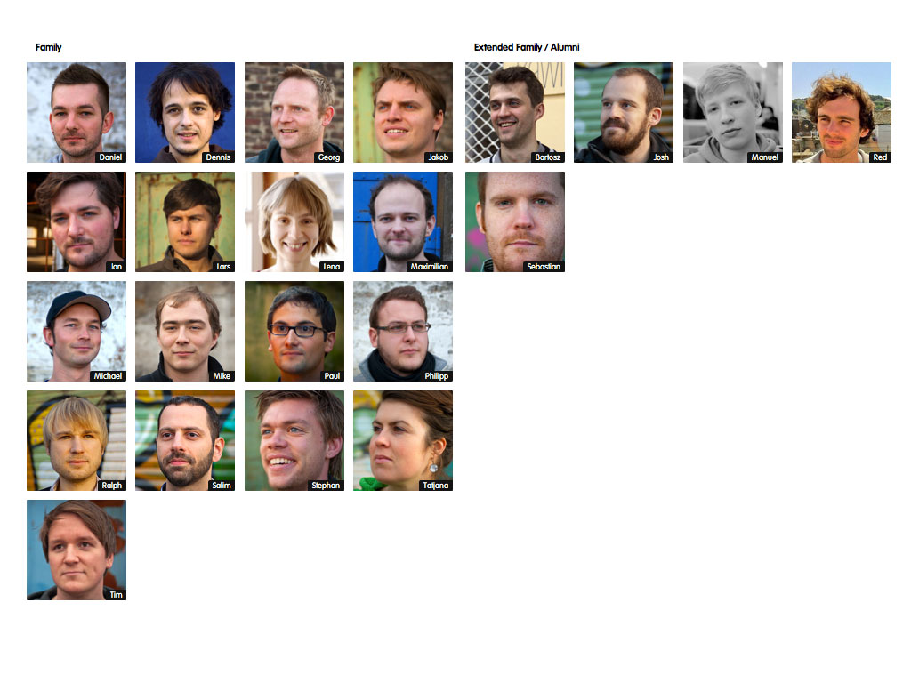

!SLIDE callout

# Vorstellung

Vortragende

!SLIDE

# Stephan Pavlovic & Jan Kus

* Stephan Pavlovic
  * 07.10.1984
  * Studium an der FH-Köln - Medieninformatik (M. Sc.)
  * Lehrbeauftragter (FH-Köln), Angestellter bei Railslove seit 2010
  * Frontendentwicklung, Projektleitung, Schulungen
  * Usergrups: UX UG, Kölsch.rb, Webmontag
  * Fussball, Basketball, Radfahren, Tennis
* Jan Kus
  * 02.05.1982
  * Studium an der FH-Köln - Medieninformatik (M. Sc.)
  * Gründer von Railslove (2008)
  * Backendentwicklung, Unternehmensleitung
  * Usergroups: Webmontag, DevHouseFriday Chillout, Kölsch.rb
  * Basketball, Kampfsport/Boxen, Joggen, Radfahren

!SLIDE callout

# Vorstellung

Railslove

!SLIDE

# Wer und Was ist Railslove

* Ruby on Rails Beratung und Entwicklung
  * Neu- und Weiterentwicklung von Webplattformen
* Entwicklung, Betrieb und Vermarktung eigener Webservices 
  * SaaS (Software as a Service - Vertriebsmodell von Software, wobei die Software und die Daten in der Cloud gehosted werden und der Zugriff durch einen thin-client (Browser) erfolgt)
  * Joint Venture mit anderen Unternehmen (z.B. Sales King GmbH, 9elements GmbH)
* Schulungen im Bereich Webentwicklung
  * Idee stammt aus dem Fachkräftemangel in unserem Bereich
  * Gründung der "Railslove University"
* Gründer von Coworking Cologne und Betreiber des Coworking Spaces “Gasmotorenfabrik Köln e.V.”
  * Für Startups, Freelancer & verscheidene User Groups
  * Arbeit, Kreativität und Spaß an einem Ort

!SLIDE

# Seit 2009 ist Railslove eine Story dreier FH Studenten

* 2008 Gründung der Bumann, Kus, Schneider GbR noch während des Studiums
  * Herstellung eigener SaaS Produkte
  * Erste Kundenprojekte

* Oktober 2010 Umwandlung in die Railslove GmbH
  * Fokus: Agentur
  * Neuer Gesellschafter: Lars Brillert
  * Mehr Mitabeiter, neue Projekte ;)

* März 2012
  * 16 feste Mitarbeiter
  * 4 Freiberufler
  * ca. 50 realisierte Projekte (Kundenprojekte und Eigenentwicklungen)
  * Fokus geteilt: Agentur und SaaS

!SLIDE

# Seit 2010 ist Railslove eine Story von mehr als 3 FH Studenten

* Erste Festanstellungen
  * Komolitonen kannte man ja
* Ab 2011 Erste Studentenjob's
  * Durch Empfehlungen und Stephans arbeit an der FH
* Heute
  * 14 feste Mitarbeiter, 2 Freelancer, 2 Studenten
  * Davon 3 Geschäftsführer, 1 Designer, 1 Business Development, 9 Programmierer
  * 6 Alumis

<!SLIDE full-page-image>

!SLIDE

# Unsere Kunden

* 9flats GmbH (http://9flats.com)
  * Buchungs-Übernachtungsportal - Neuentwicklung, Weiterentwicklung
  * MySQL, Redis, Rails, Internationalisierung
* payango GmbH (http://payangocard.de/)
  * Pre-Paid-Kreditkartenportal
  * Bankwesen, Kreditkartenbestellung, Rails, Redis, Mysql, NoSQL
* Avocado Store GmbH http://avocadostore.de/)
  * Store für Nachhaltige-Produkte
  * Shopsystem, Diverse Bezahlmöglichkeiten
* Studitemps GmbH (http://jobmensa.de)
  * Jobbörsenportal für Studenten
  * Weiterentwicklung, Rails 2 - 3 Migration
* http://railslove.com/work

!SLIDE

# Eigene Produkte

* Salesking.com
  * Rechnungswesenapplikation als Software as a Service Angebot
  * Beteiligung bei der Sales King GmbH (zweitgrößter Anteilseigner)
* Tipplr.de
  * Customizable-B2B-Tippspiel
* Dealbaseapp.com
  * Dealflow Applikation im Venture Capitalists (VC's) Bereich
* University
  * Schulungsprogramm für Firmen, Hochschulen und Privatanwender
* Hackerspursuit, Kölsch-Deckel, SMURF, usw.
  * Kleinere "Spass-Projekte"
  * Opensource und in unserer Freizeit entwickelt

!SLIDE

# Kooperationen

* MEDIEN.NRW (Öffentliche Institution)
  * Organisation von Hackathons und Events

* European Pirate Summit (Private Institution)
  * Medienpartnerschaft

!SLIDE chapter-opener

Unsere Ziele

Wir möchten europaweit als "die" kölner Entwicklungsagentur wahrgenommen werden. 

Wir wollen durch Qualität, Flexibilität, Dynamik und Kreativität überzeugen und gute Ideen fördern.

Das alles natürlich mit kölschem Humor ;-)

!SLIDE callout sk-red

# Hands On I

Lets play some Hackerspursuit http://hackerspursuit.com

!SLIDE

# Stellt jeweils eine Frage zu einem paar an Kategorien und Subkategorien:
* Kategorien
  * ["programming", "culture", "backend", "frontend", "design", "startup & founding", "social" ]
* Subkategorien:
  * ["algorithms", "api", "bash", "C", "couchdb","css", "culture", "data", "encoding", "flash", "graphics", "haskell", "html","http","javascript", "php", "python","rails","ruby","regex", "modelling",  "databases", "assembler", "general"]
* Gibt vielleicht eure E-Mail Adresse und Github-/Twitter-Handle an, dann werden wir die Fragen auch in das Spiel integrieren.
* 10 Min. Bearbeitungszeit

!SLIDE

# Eure Fragen I

* Welches Element gibt es nicht beim DFD (Datenflussdiagramm, Programming/modelling)?
  * Speicher
  * Funktion
  * Datenfluss
  * Benutzer (x)
* Was darf ein Trigger nicht enthalten (Programming/Databases)?
  * Insert
  * Select
  * Update
  * Commit (x)

!SLIDE

# Eure Fragen II

* Was ist ein XOR-Befehl in Assembler (Programming/assembler)?
  * Eine Exclusiv-ODER Verknüpfung von Registern
  * Ein Wildcard-ODER-Befehl
  * ?
  * ?

* Was ist eine abstrakte Klasse (Programming/General)?
  * ?
  * ?
  * ?
  * ?

!SLIDE 

# Eure Fragen III
  
* Was ist ein socket (Programming/General)?
  * ?
  * ?
  * ?
  * ?

* Unterschiede zwischen equals und == in Java (Backend/Java)?
  * ?
  * ?
  * ?
  * ?

!SLIDE 

# Eure Fragen IV
 
* Was ist eine objektorientierte Sprache (Programming/General)? 
  * ?
  * ?
  * ?
  * ?

* Wie kann man einen Float beenden?
  * clear (x)
  * margin
  * padding
  * nie