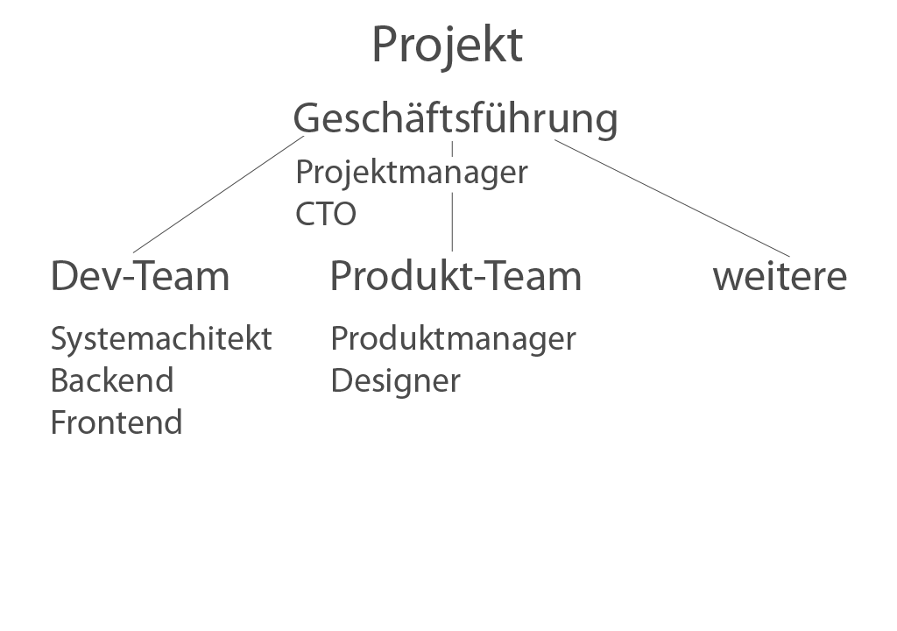

!SLIDE callout

# Die Rollen

eines Informatikers

<!SLIDE full-page-image>

!SLIDE

# Rollen
* Geschäftsführung (CEO)
  * Planung der Unternehmensstrategie
  * Schließen strategischer Partnerschaften
* CTO & Projektmanager
  * Planung und Organisation des IT-Teams
* Entwickler
  * Umsetzung (und Konzeption) einer Applikation
* Produkt
  * Konzeption und Strategieentwicklung des Produkts

!SLIDE callout sk-red
# Hands On III

Rollen eines Informatikers

!SLIDE

# Aufgabe

* In welcher Rolle seht ihr euch
  * Geschäftsführung
  * CTO & Projektmanager
  * Produktmanager
  * Entwickler
  * Architekt