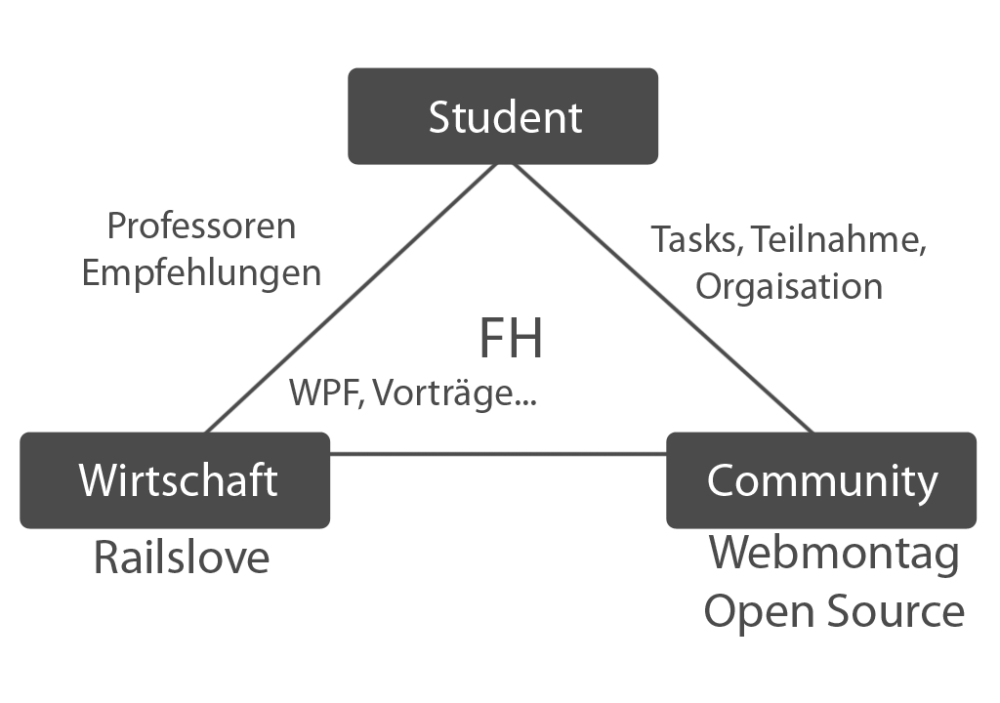
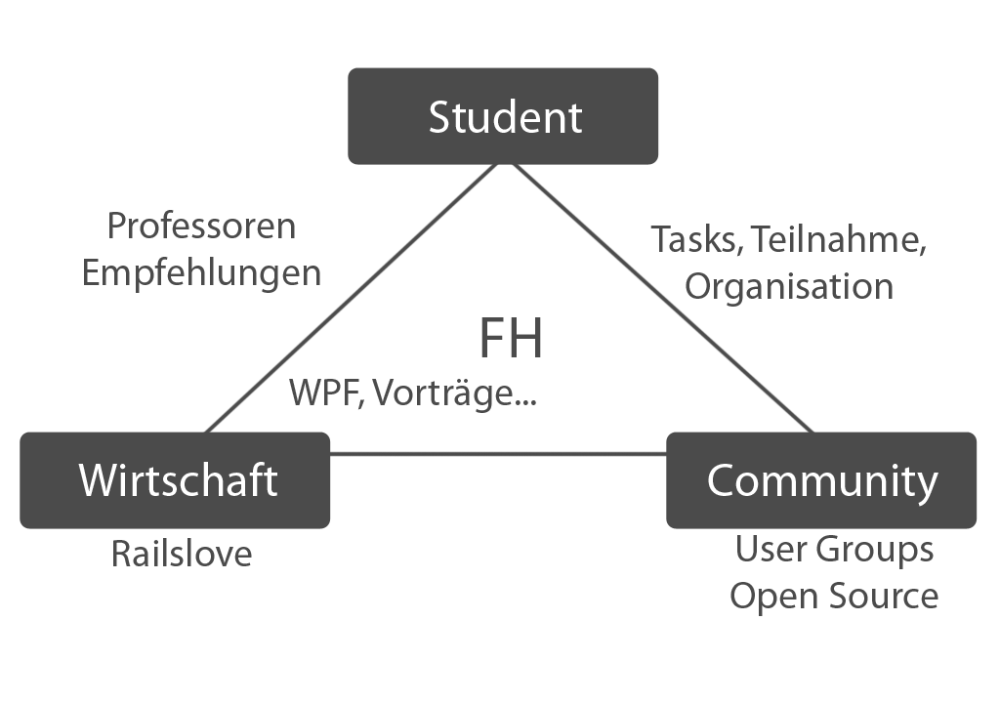

!SLIDE callout

# Die Wege

in die Wirtschaft

!SLIDE

# Wie gelange ich überhaupt in die Wirtschaft

* Der Übergang nicht einfach
  * wenig praktische Erfahrung
  * nicht direkt klar wohin der Weg führt
  * keine Kontakte
* Den Übergang fliessend gestalten
  * sich einen Studentenjob suchen
  * auch vor dem Wechsel keine Angst haben - flexibel bleiben
  * Events, Konferenzen, Meetups besuchen
* Gründen, Freelancen oder Festanstelung
  * seine Spezialisierung finden
  * sich fragen: was kann ich gut
  * und damit Geld verdienen!
  * Gewerbeeröffnung kostet 30 Euro :)

!SLIDE callout

# Wer hat von Euch schon 

ein Unternehmen oder Gewerbe?

!SLIDE

#Fragen

* Wer von euch hat einen Studentenjob?
* Wer davon im Informatikumfeld?
* Wer besucht User groups (welche)?

<!SLIDE full-page-image>

<!SLIDE full-page-image>

<!SLIDE full-page-image>

!SLIDE callout sk-red

# Hands On II

Events

!SLIDE

# Aufgabe

* Stellt Euch vor Ihr organisiert ein Event, dass die Uni an die Unternehmen näher bringen soll. Wie würdet Ihr es nennen? Wäre das eher eine Steh oder Sitzveranstaltung? Würdet Ihr Vorträge zulassen?
* 10 Min. Bearbeitungszeit, Vorstellung und kurze Pause