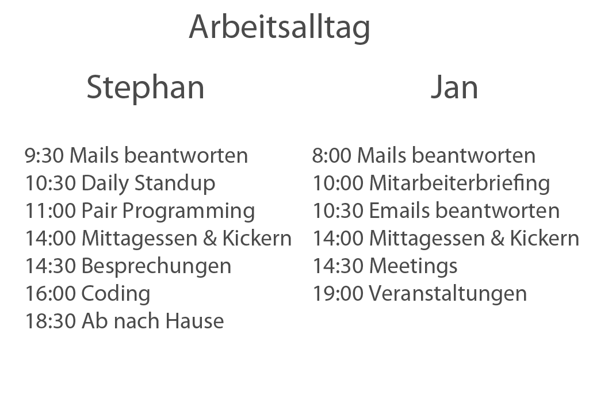

!SLIDE callout

# Der Informatiker

und sein Leben

!SLIDE

# Effizient Arbeiten und Gesund leben

* Effizient Arbeiten bedeutet
  * Konkrete Aufgaben haben
  * Ziergerichtet arbeiten
  * Chancen und Risiken erkennen
* Dadurch arbeitet man
  * Lösungsorientiert
* Einsetzen von Methodiken, Techniken und Werzeugen
  * Helfen

!SLIDE

# Effiziente Projektarbeit

* Tasks-/Todolisten
  * Notitzblock (Offline)
  * Wunderlist (Online/Web)
  * Omnigraffle (Offline/OS X)
  * Einsetzen was man möchte
* Methodik der Agilen Softwareentwicklung einsetzen
  * Scrum
  * Pivotaltracker als Werkzeug um Tasks im Team zu verteilen
  * http://pivotaltracker.com
  * Sprint Meetings/Stand ups
  * Scrum-of-Scrums 
* Technik des Pair-Programmings einsetzen
  * Nicht alleine Arbeiten
  * Humans are crowd animals  

!SLIDE

# Den Alltag organisieren

* Termine ausmachen
* Coden ohne Störfaktoren
* "Gespräche Nebenbei"
* Auch mal Auszeit nehmen: Kickern, Basketball, usw.
* Wie sieht ein Alltag bei Railslove aus

<!SLIDE full-page-image>

!SLIDE

# Wie werde ich besser

* Zusätzlicher Wissenstransfer durch
  * Besuch von User groups
  * Pairprogramming
  * Lernen, Vortragen und Lehren

!SLIDE

# Einen funktionierenden Körper zu haben ist wichtig

* Wir arbeiten mit unserem Kopf - der ist aber ein Teil unseres Körpers
* Schlussfolgerung: Damit unser Kopf gut funktioniert muss der Körper auch im guten Zustand sein
  * Vermide: Stressvolle Projekte und Stressvolle Kunden
* Burn out (auch im Studium)
  * Ist ein Blocker

!SLIDE

* Viel Obst essen
  * in ~25 von 50 Krankheiten kann ein Apfel einer Krankheit entgegenwirken
* Regulär Schlafen
  * mach regelmässig ein Mittagsschläfchen
  * Red Bull hilft nicht
* Bewegung
  * 30 Minuten Aktivität am Tag hilft gegen: Depression, Übergewichtigkeit, und zu hohem Bluddruck
* Sich richtig ernähren
  * Die Ernährung ist sehr wichtig
  * Wenn Du Gewicht verlieren möchtest - geh dies langsam an
* Such Dir ein Hobby
  * etwas wo Du richtig entspannen kannst
  * lass Dich bei Tieren insperieren
  * Sport etc.

!SLIDE callout

Roundup

!SLIDE

# Roundup I

* Heute haben wir ein paar Rollen eines Informatikers aufgezeigt
  * Geschäftsführung
  * Projektmanager, CTO
  * Entwickler
  * Produtkmanager
  * Architekt
* Wir haben vertieft die Rolle des Geschäftsführers besprochen
  * Wann und wie eine Gründung erfolgen sollte
  * Wie man den pragmatische Weg gehen
  * Ideen sind nur dann wertvoll wenn sie realisiert werden

!SLIDE

# Roundup II

* Wir haben vertieft die Rolle des Informatikers in der Entwicklung angesprochen
  * Typische Aufgaben
  * Systemarchitekt
  * Frontend-Entwicklung 
  * Backend-Entwicklung
* Weiterhin die Rolle des Produktmanagers und seines Teams vorgestellt
  * Arbeitsprinzipien
  * Usability engineer
  * Produktmanager, Projektmanager
  * Designer

!SLIDE

# Roundup III

* Zusätzliche Ratschläge und Tipps zum Effizienten und gesunden Arbeitsleben aufgezeigt
  * Einsetzen von verschiedenen Tools
  * Gesunde Ernärung
  * Genügend Schlaf
  * und viel Bewegung

!SLIDE callout

Ressourcen

!SLIDE

# Ressourcen

* http://www.startuplessonslearned.com/2009/03/minimum-viable-product.html
* http://www.oreillynet.com/onlamp/blog/2005/08/ideas_are_just_a_multiplier_of.html
* Der Weg zum erfolgreichen Unternehmer: http://www.amazon.de/erfolgreichen-Unternehmer-Unternehmen-Dynamik-gewinnen/dp/389749793X
* Getting Real: http://gettingreal.37signals.com/ 
* Bessere Entwicklung durch agiles Projektmanagement: http://t3n.de/magazin/projektmanagement-unternehmen-verplant-229601/
* Manage it: http://pragprog.com/book/jrpm/manage-it

!SLIDE callout

Events im Juni

!SLIDE

# Anstehende Events I

* **Webmontag Köln (04.06.):** Webmonday is an informal, non-commercial, and completely community-driven event that aims to connect the people who are shaping the future of the internet. As usual we’re discussing interesting web driven topics, hacking ideas etc. Check out: http://www.webmontag.de/location/koeln/2012-06-04

!SLIDE

# Anstehende Events II

* **European Championship Public Viewing @ Cowoco (8.+9.06):** We will celebrate the start of this years European Championship by watching the first matches at cowoco starting around 17:30 PM an June 8th and 9th. Everyone is welcome to join us at Cowoco and 2012.coworkingcup.com

!SLIDE

# Anstehende Events III

* **Cologne JS (12.06.):** For all Javascript and Frondend Fanboyz. Starting at 7PM at Coworking Cologne (Gasmotorenfabrik)

!SLIDE

# Anstehende Events IV

* **Limited WIP Society Cologne (13.06.):** The Kanban Usergroup Köln. 7PM at Coworking Cologne (Gasmotorenfabrik)

!SLIDE

# Anstehende Events V

* **mobile.cologne (14.06.):** A lightning talk evening covering all aspects across mobile development. 7PM at Coworking Cologne (Gasmotorenfabrik)

!SLIDE

# Anstehende Events VI

* **Webmontag Bonn (18.06.):** Starts at 7:30 PM at Waschsalon

!SLIDE

# Anstehende Events VII

* **Cologne/Kölsch.rb (20.06.):** Like every month the Cologne Ruby User Group meets for some very interesting discussions.  This month for example about using OpenStreetMap. If you have any point of contact with Ruby development this event should be required for you. For more information check out http://www.colognerb.de/events/juni-meetup-2012.

!SLIDE

# Anstehende Events VIII

* **Goldschmiede – Kodieren auf Kölsch (22.06.):** For all Node.js-Fanboyz. Starts at 5:30 at the anderScore GmbH office

!SLIDE

# Anstehende Events IX

* **C’n'B Convention (20.-22.06)**

!SLIDE

# Anstehende Events X

* **DevHouseFriday Chillout (29.06.):** The next DevHouse Friday is happening @ Pixum – “Wir machen den DevHouse Friday Chillout zum Erlebnis” and is a great chance go meet a lot of interesting people around the Cologne web scene. For more information check out http://devhousefriday.org/networks/events/show_event.52536.

!SLIDE

# Anstehende Events XI

* **Bastelnachmittag Every Friday:** the Dingfabrik meets in their rooms for Bastelnachmittag. Just play around with your arduino or do some origami – everyone can have some fun! Date: Friday 4th of May. For more information check out: http://hcking.de/events/84-dingfabrik-bastelnachmittag