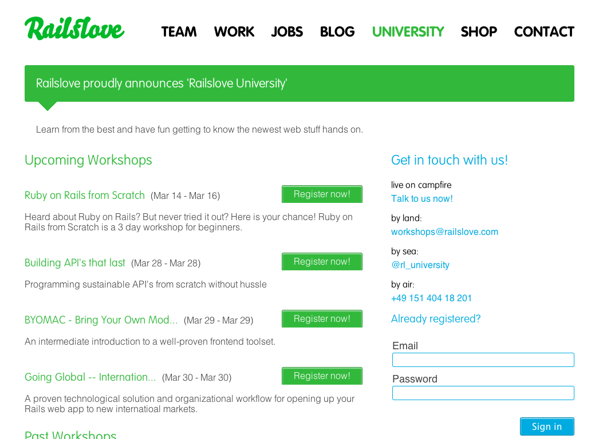

!SLIDE callout

Schulungen

!SLIDE

Railslove University

* Das Problem
  * Entwicklermangel auf dem Fachmarkt
  * Förderung von Studierenden
  
* Die Ziele
  * Nachwuchsförderung
  * Wissensaustausch
  * Ausschöpfung des wirtschaftlichen Potentials

* Zielgruppe
  * Freelancer (Schulungen im Coworking Space)
  * Unternehmen (Inhouseschulungen ab einer gewissen Anzahl an Teilnehmern)
  * Studenten

* 2012 Stärkung des Austausches zwischen
  * Unternehmen (vor allem in NRW)
  * Öffentlichen Institutionen (Uni, FH, VHS, ...)

!SLIDE full-page-image

