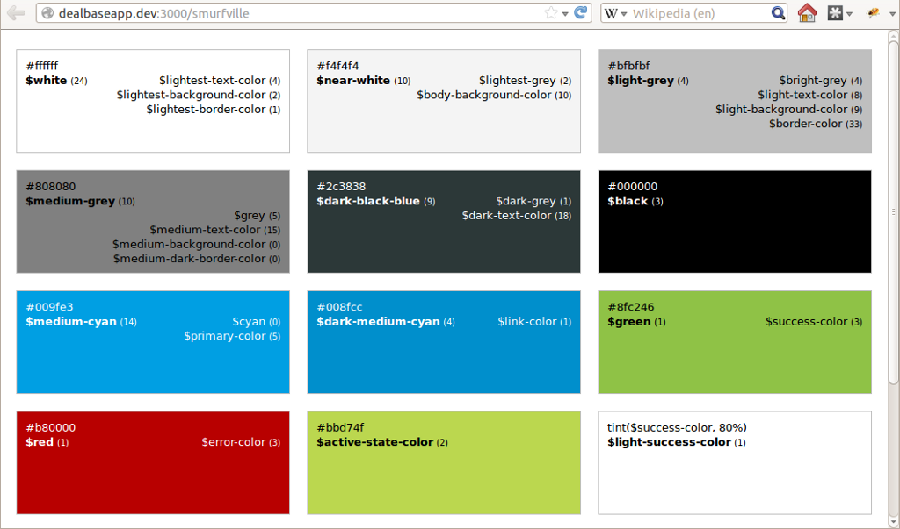

!SLIDE callout

# Beyond the code: #

6) Create a "Living Styleguide"

!SLIDE bullets incremental

# Why a living styleguide? #

* Most important:  modules need to be reused!
* Not only by developers, but also by designers
* A **living styleguide** can:
- -> be a great communication device
- -> create awareness

!SLIDE bullets incremental

# How does it work? (theory) #

* 1) follow some convention in your frontend code
* 2) inspect code and derive style information
* 3) render styleguide
* 4) PROFIT!

!SLIDE bullets incremental

# Practical example:  Living Sass Color Styleguide #

* Goals behind this styleguide:
* It should always reflect the current state of color usage
* Color usage should be consistent and DRY
* There should be no effort beyond initial setup
* Bonus: Individual colors should be easy to change

!SLIDE bullets incremental

# Step 1) Follow code convention:  Sass color variables #

    @@@ CSS
    // ---- literal colors ----
    $black: black
    $grey: #ccc
    ...

    // ---- semantic color mappings ----
    $primary-color: $cyan
    $accent-color: $light-blue
    $alert-color: $red

    // borders
    $border-color: $grey

    // text
    $light-text-color: $white
    $medium-text-color: $grey
    $dark-text-color: $dark-blue
    ...

!SLIDE

# Excursion: Sass variable naming convention #

<pre class="sh_javascript sh_sourceCode">
  <code>
    $modifier-object-variable_type

    $light-text-color
    $small-headline-font-size
    $big-border-radius
    $standard-user-image-width
    ...
  </code>
</pre>

!SLIDE bullets incremental

# Step 2) Extract style information:  Smurfville Gem #

* Takes less than 5 minutes to install
* 1.) Gemfile: <code>gem 'smurfville'</code>
* 2.) Initializer: tell it where your stylesheets are
* 3.) Routes: <code>mount Smurfville::Engine => "/styleguide"</code>
* 4.) **PROFIT!**

!SLIDE full-page-image

!SLIDE callout

Definitely try this at home!
