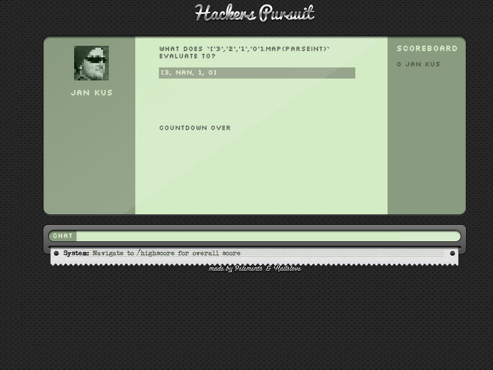

!SLIDE callout green

# After 100 Millions years some freaks discovered the potential and invited...

Hackerspursuit

!SLIDE

Hackerspursuit

* A Railslove - 9elements join venture project: 
  * Nerd Pursuit: http://github.com/nerds/NerdPursuit
  * Hackerspursuit: http://github.com/9elements/Hackerspursuit

* A super super sexy realtime game
  * based on node.js
  * and iced-coffee-script

* Twitter:
  * @hackerspursuit

!SLIDE full-page-image

!SLIDE full-page-image

!SLIDE callout green

# And now...

a Demo please http://hackerspursuit.com/

!SLIDE callout orange

# U NO HAVE ONE MORE THING?

yes I do!

!SLIDE full-page-image

!SLIDE full-page-image

!SLIDE callout green

# Is it only a game?

No

!SLIDE

Hackerspursuit is

* a Game
  * Kids are the future
  * Gamboyify your life (Dr Kawashima's Brain Training is the past)
* a learning plattform
  * We need true coders! 
  * Everybody talks about it
* your curriculum vitae but
  * Y U NO NEED CV
  * U NEED HackerDNA
* a hiring interview tool
  * show to your boss how cool you are
  * show him your badges
* a company profile
  * they want to present their coolest coders (and they will pay for it)
  * e.g.: /companies/adcloud

!SLIDE callout lila

# But we need

Questions!

!SLIDE callout lila

https://github.com/Nerds/NerdPursuit
