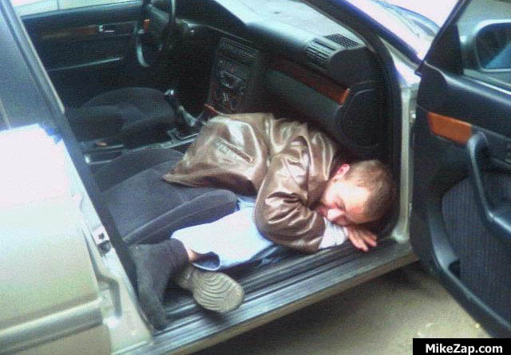
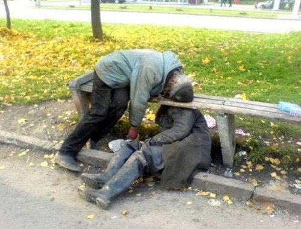

!SLIDE callout lila

# 1 year ago...

We were driving back from Railscamp Polska I

!SLIDE full-page-image

!SLIDE callout lila

# And invented

Nerd Pursuit

!SLIDE callout orange

# Thanks 

AGATA

!SLIDE callout sk-red

# It's Trivial Pursuit

for NERDS

!SLIDE

# Nerd Pursuit is a question database hosted on Github

* http://github.com/nerds/nerdpursuit
* Everybody can (SHOULD) participate in pushing new questions

* Questions defined by a JSON-Schema
  * 1 Question and 4 answer possibillities

!SLIDE full-page-image

