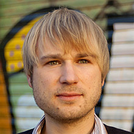

!SLIDE wroclove_opener

empty

!SLIDE callout wroclove logo_sk_rl

# Lets talk about

Get out of the trap!

!SLIDE callout wroclove

Who are we?

!SLIDE callout logo_sk_rl

!SLIDE callout wroclove

# What

are we doing?

!SLIDE

# What are we doing?

* Web Development with Ruby on Rails as an agency
* Products as a startup
  * http://salesking.eu
  * http://happypdf.com
  * http://tipplr.de
* Teaching/Courses
  * http://university.railslove.com
* And other crazy things
  * Co-Founder of Coworking Cologne (Coworking Space “Gasmotorenfabrik Köln e.V.” in Cologne)
  * http://cowoco.de

!SLIDE chapter-opener

Get out of the trap!

Is a talk about programmers life. 

As developers and business founders, we present the best of our own mistakes and show you how we got out of the pits we fell into.