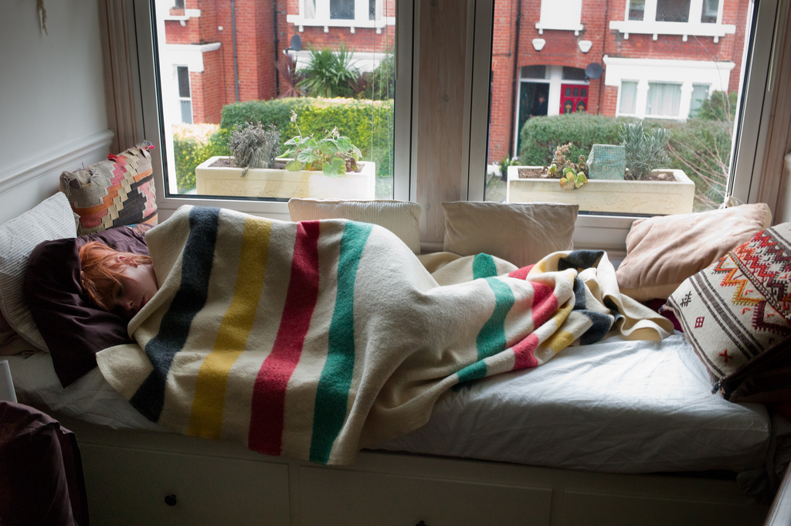
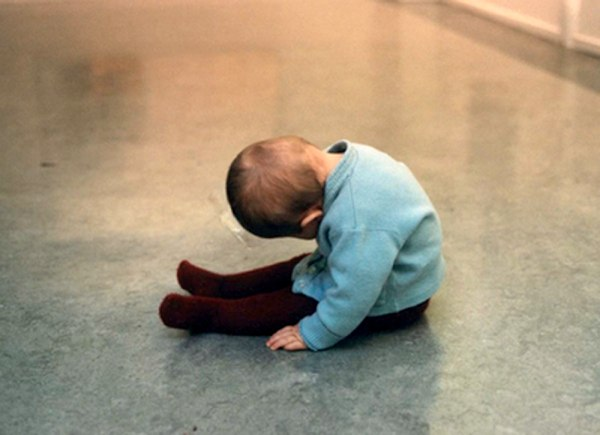
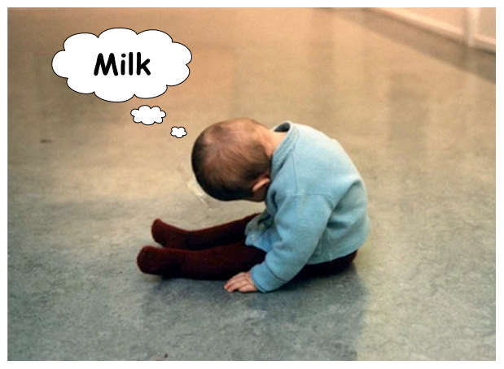
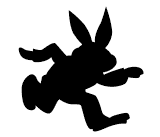
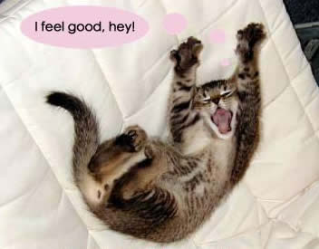
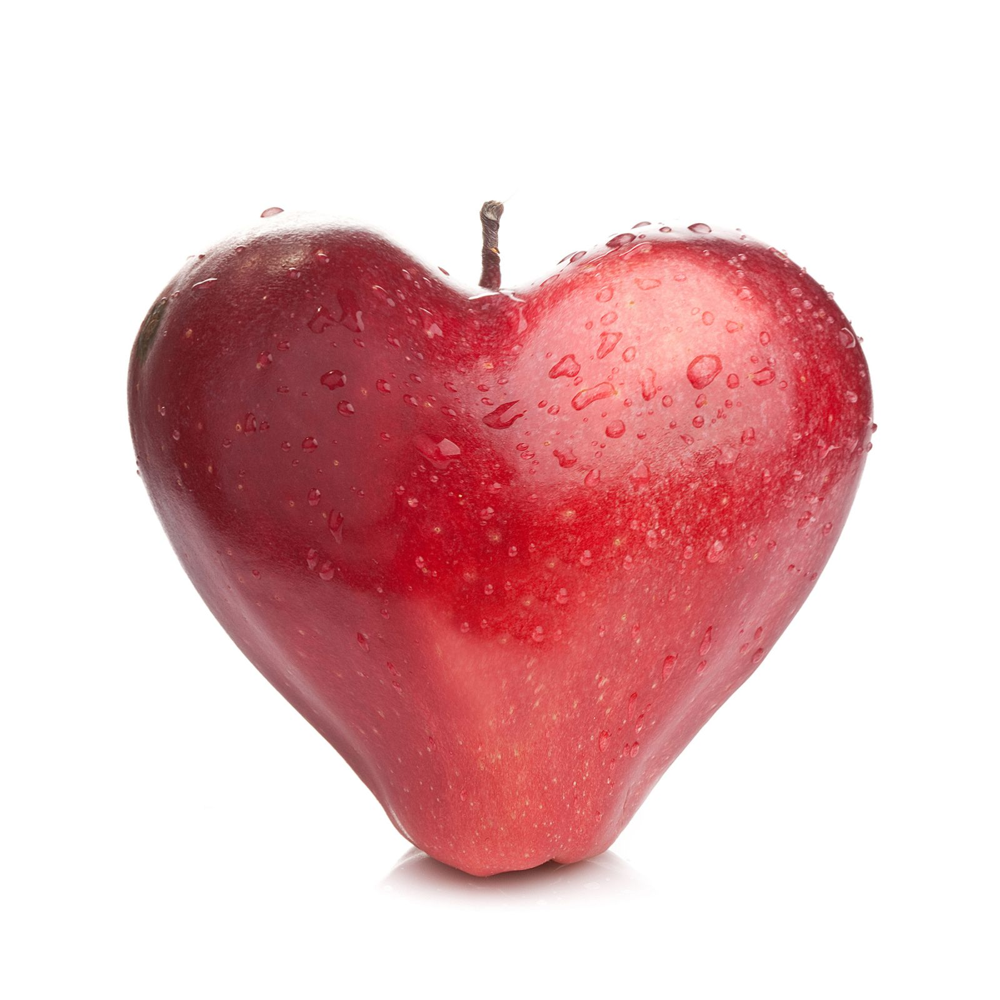

!SLIDE callout lila

# Lets talk about 

Body Debt

!SLIDE callout lila

# Having a working body is important

We mostly work with our minds, but the mind is a part of the body

!SLIDE callout cyan

# Conclusion

For the mind to work well, the body must be in good shape

!SLIDE callout sk-red

# U NO TREAT YOUR BODY

Not treating the body right leads to a mortgage that has to be paid back 

!SLIDE callout sk-red

# AVOID

Stressful projects

!SLIDE callout sk-red

# AVOID

Stressful clients

!SLIDE callout green

# There are plenty of other

Projects and Clients out there

!SLIDE full-page-image

<!-- !SLIDE 

# Stressful projects

* Stressing out the body, b/c of customer complaints, deadlines etc.
* Be open, be realistic, don't over-promise and under-deliver
* Avoid customers that stress you out, there are plenty of other jobs/customers
* Don't put more work in a week than your body can take
* If you have to stress you out for some days or even weeks:
  * Reserve more time for recovery
  * e.g. fewer tickets for the next sprint
* Will help against burn out and you will think about your work in a positive way
 -->
!SLIDE callout sk-red

# Please believe us

Burn out is a real blocker!

!SLIDE callout cyan

# Sleep RIGHT

It's your PALIWO

<!-- !SLIDE 

# Sleep right

* Sleep is needed for recovery
* Sometimes we wake up full of energy, sometimes not. Why?
  * Determine if you are a lark or an owl: What time would you get up and go to sleep if you were entirely free to plan your day?
  * Lark: Wake at 6am, sleep at 9 to 10 pm
  * Owl: Wake at 8 to 9 am, go to bet at midnight or 1 am
* Stick to your sleep cycle (Wakemate etc.) 
-->

!SLIDE full-page-image

!SLIDE callout lila

# Reguraly take a
Nap

<!-- !SLIDE 

# A Nap

* Mammals are programmed for 2 periods of intense sleepiness
* Consolidating sleep in 1 large sleepiness is not as recovering as 2 periods
* Short naps can help
  * Lark: 1 or 1:30 pm
  * Owl: 2:30 or 3 pm
* You cannot work "full steam" during your midday wave of drowsiness
* So you can as well take a nap
* Ideal length: 20 (light sleep) to 45 (including REM) minutes
* Eye shades to protect your eyes from light
* Headphones with white noise agains noise
* Enjoy the energy boost after the nap
 -->

!SLIDE callout lila

# Look at the nature

Mammals are programmed for 2 periods of intense sleepiness

!SLIDE full-page-image

!SLIDE full-page-image

SLIDE callout lila

# Look at the nature

Mammals are programmed for 2 periods of intense sleepiness

!SLIDE callout lila

# A Nap

Will help you stay focussed during most of your work time

!SLIDE callout sk-red

# And NO!

Red Bull WON'T HELP

!SLIDE callout lila

# More nap styles

You can find in the nature

!SLIDE full-page-image

!SLIDE full-page-image

!SLIDE callout lila

# Everybody has his own nap style

find yours

!SLIDE callout orange

# Enjoy the energy 

BOOST after the nap

!SLIDE full-page-image

!SLIDE callout cyan

# 30 minutes of activity a day

help against

!SLIDE callout sk-red

Depression

!SLIDE callout sk-red

Obesity

!SLIDE callout sk-red

High blood pressure

!SLIDE callout green

# Start

Slowly

!SLIDE callout green

# Stay

Healthy

!SLIDE callout green

# Live 

longer

!SLIDE full-page-image

<!-- !SLIDE 

# Activity

* Start slowly
* Will help you stay healthy
* live longer and feel well in your body
-->

<!-- !SLIDE 

# Eat right

* You're diet is important
* If you want to lose weight: Do it slowly.
* Will help you stay healthy, live longer and feel well in your body -->

!SLIDE callout lila

# Eat right

You're diet is important

!SLIDE callout lila

# If you want to lose weight

Do it slowly

!SLIDE callout

!SLIDE full-page-image

!SLIDE callout cyan

# in about ~25 from 50 diseases

an apple can prevent from being sick

!SLIDE callout orange

# Get a hobby

Be inspired by other arts

!SLIDE callout sk-red

# Maybe you find something else besides

PHOTOGRAPHY

<!-- !SLIDE

# Draw inspiration from other arts

* Get a hobby
* Be inspired by how other people solve problems
* Stepping back will help you see the whole picture
* Will help you find solutions that others don't see
 -->