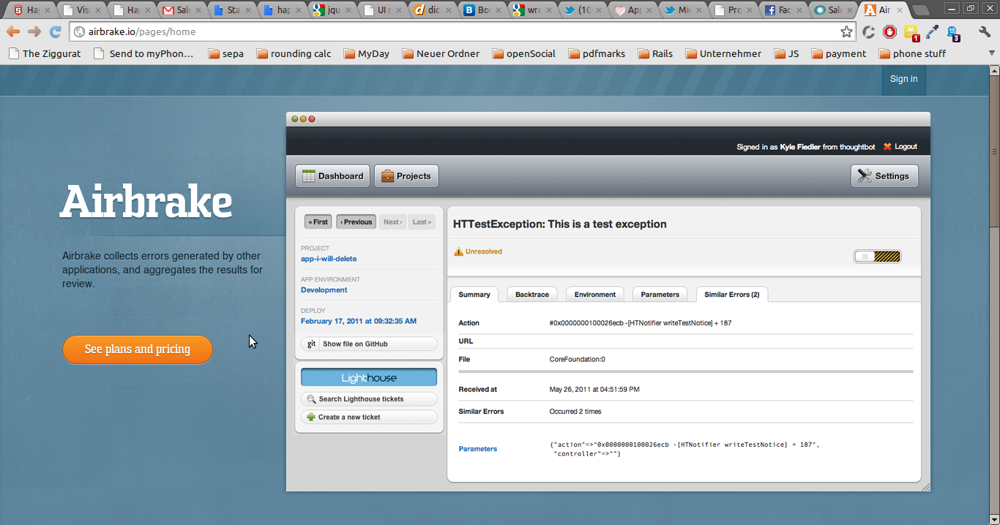
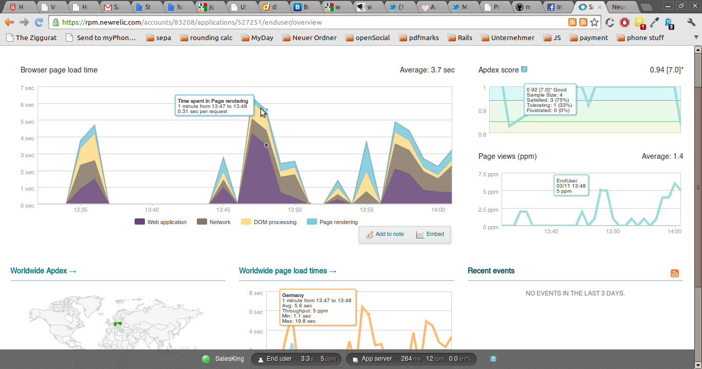

!SLIDE callout

# Watch your servers

Monitoring

!SLIDE full-page-image

!SLIDE full-page-image

!SLIDE full-page-image

!SLIDE callout

# Read your logs with

Greylog

<!-- !SLIDE

# Monitoring

* Know your servers
* Low level monitoring: RAM/CPU/disk usage
* Graph most important metrics (e.g. Ganglia)
* Use your log files (e.g. Greylog2)
* Use a service like Newrelic
* Use a service like Hoptoad
* Will help you see potential problems and upcoming disasters
 -->