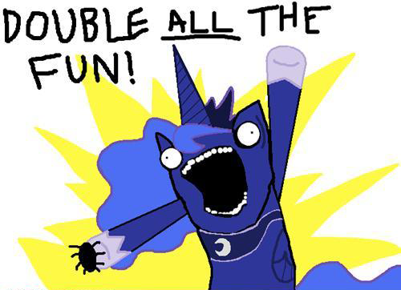

!SLIDE callout cyan

Get better

!SLIDE

# Pair all the time you get the chance to

* Exhausting
* Take breaks, but not too long
* Leads to better code
* Leads to better programmers

!SLIDE callout orange

!SLIDE callout cyan

!SLIDE

# Coworking

* Find pairs online or in your local user group
* Go coworking

!SLIDE callout cyan

# If you don't have a space nearby

Create one

!SLIDE callout lila

# U NO NEED MONEY

Only the right place and people

!SLIDE full-page-image

!SLIDE full-page-image

!SLIDE full-page-image

!SLIDE full-page-image

!SLIDE full-page-image

!SLIDE

# Look at other spaces & talk to people

* http://coworking.de
* Staszek, me, Ralph

!SLIDE

# Use stackoverflow and the like

* Global community
* Problem example: Calculate age from day of birth
* Someone else probably had you problem before
* Get feedback, find potential problems in your solution
* Help others, if you found an alternative/better solution

!SLIDE callout sk-red

# U NO ONLY SEARCH

Also help others and post your solutions

!SLIDE

# Go to your local user group

* There's always much to learn
* Ask other people how they would solve you current problem
* As soon as you find something interesting, teach

!SLIDE full-page-image

!SLIDE full-page-image

!SLIDE full-page-image

!SLIDE

# Play games like a pirate!

* go go go